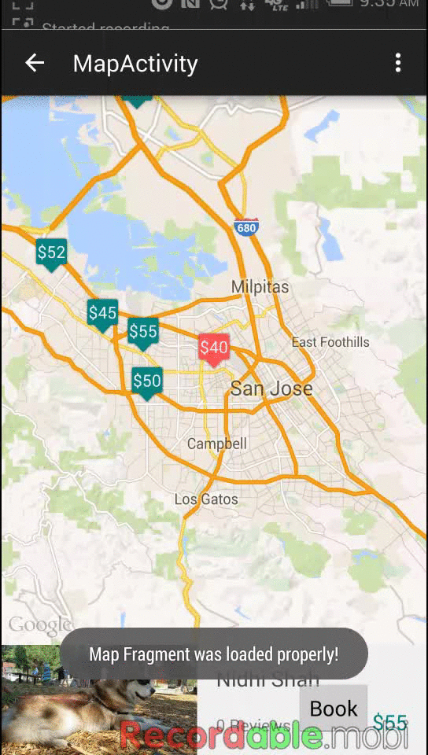

#PetVacayWeekOne
First sprint before merging with rest of the team members

The Profile view has the following : A. User is not logged in

* [x] PetVacay logo is displayed at the top.Clicking on this takes the User to the Login screen Right below the          above,User sees messages icon, wishlist icon and settings icon and with the latter 2 disabled/greyed out

* [x] Below the above icons, User can click on “How it works?” and this takes him/her to a separate view with            options to:                                                           
     a) Sign Up and Log in at the bottom of the screen
     b) Skip on top right, which takes them to Home view                                                       
     c) Go Back on top left, which takes them to Home view                                         

 * [x] Below the above, User can click on “List your space” and it takes him/her to login screen
      *  For now the user is taken to a a screen to take a picture from their camera or upload from gallery
      *  This will later be moved out and integrated into the appropriate place
      *  Did not have time to record this on the phone, so the GIF shows the use of the emulator
 
* [x] Below the above, User can click on “Help” and is taken to a separate “Help”screen( details of this screen          still need to be chalked out)

* [x] At the bottom of the page, User can click on “Log In or Sign Up” which takes them to Login screen

 Walkthrough of all user stories:

   

Things that need tweaking:
*  Log In screen is pending
*  Resize images to retain aspect ratio
*  Change text title, content and background color of buttons when swiping through(replace fragments with             activities and then use view pager to do this)
* Get rid of action bar and replace with View pager
* Add divider between “Sign Up” and “Login”
* Lock navigation drawer when after the item in the list view is clicked on
* Actual push of the picture to the user table in Parse
* Giving the user an option to remove/delete pictures just taken/uploaded fomr gallery
* Code at https://github.com/anubharadwaj/PetVacayWeekOne.git

------------------------------------------------------------------------------------------------------------------
When a user first gets the app and opens it (i.e. they're not logged in), they see the landing page, which:
* [x] shows a list of sitters within a 20 mile radius, with cute pictures with their 'guests' and a couple lines of review if they have any. The pictures have been adjusted so the width is fixed and the height is variable to maintain aspect ratio (using parse resize(target_width, 0)). Used a 3rd party ellipsizing library to get middle ellipsizing to work for multiple lines. 
* [x] it says that the <host_name> is a verified host if they don't have any reviews yet, but their listing falls within the 20 mile radius 
* [x] the list view header is a search bar with auto-complete, in case the user needs a set of listings in a different area. Currently, it just toasts the selection. However, it will actually pass it to a 'search' activity/fragment. 
* [x] All the data on the landing page comes from our Parse db schema and is not static. 
* [x] When the user clicks on a listing, theoretically it will pass the latitude and longitude to a different listings activity. However, for now I've connected it to my 'map' piece. 
* [x] The map piece shows the listings within the 20 mile radius with markers containing the cost. 
* [x] There is a view pager at the bottom that provides a quick summary of the listing. 
* [x] As we swipe through the fragments, the corresponding marker on the map is 'highlighted' (i.e. a different color) 
* [x] Push notification: The summary fragment won't actually have that ugly 'Book' button. That's meant for a separate activity. However, I've added it here to show the push notification. Currently, it pushes to all devices that have the app because we don't have logins setup. (There's a 2nd gif without the ugly button too) 

To do (only for the above, not including sprint 2 here): 
* Need to color map markers so that the markers corresponding to 'seen' listings have a 3rd color. 
* Need to setup login so that the push notification only goes to the sitter that was booked. 
* Need to make the placeholder images on the landing page theme appropriate 
* Need to make the search bar background image also theme appropriate 
* Currently, the swipeable fragments show 0 reviews for the 1st couple fragments even though they have reviews (need to fix that using listener pattern for asynchronous calls) 

Video walkthrough with push notification (and ugly button) 

Video walkthrough without push notification

Code is here for now: https://github.com/vlaljani/PetBnBCodePathVL
