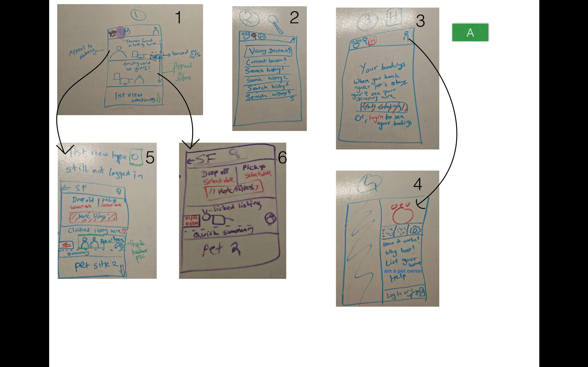
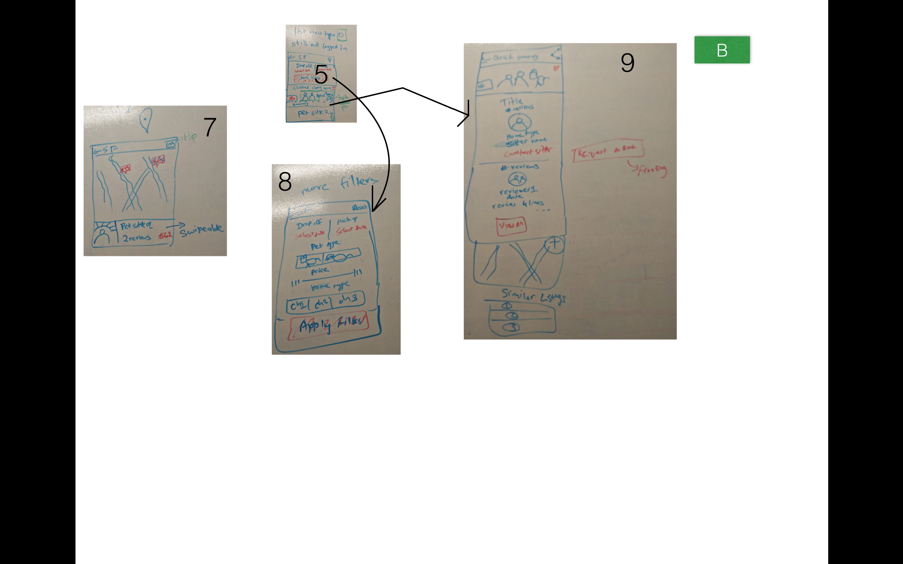
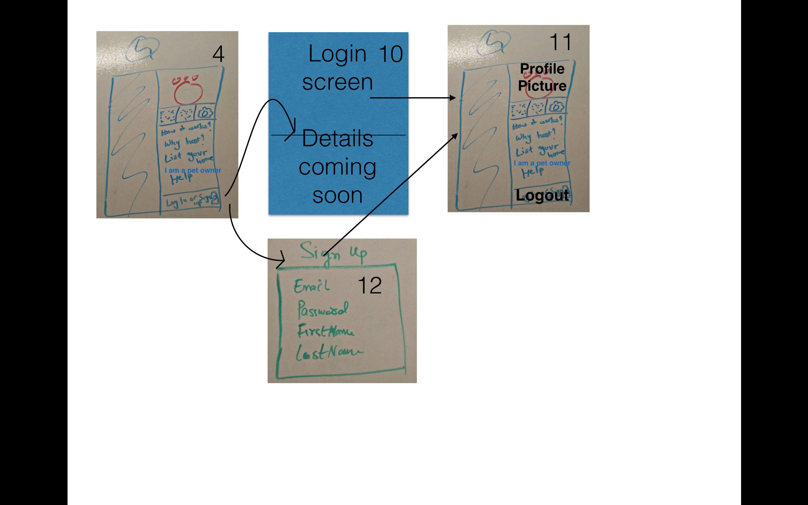
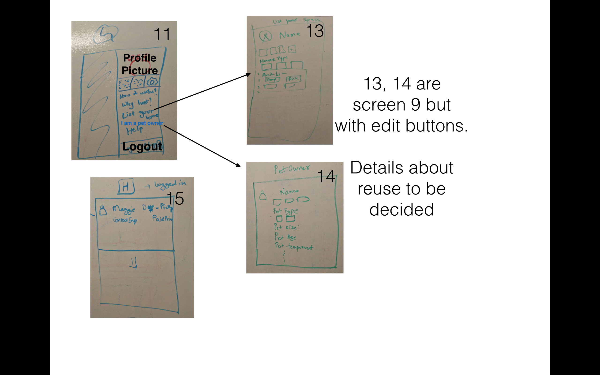

# CodePathPetBnB
Provide safe, affordable, and convenient boarding service for pet owners! 

Required stories:

* User can switch between home, search, history and profile views using tabs

* The Home view (Screen 1) has the following :
  *It is a listview with a background image (typically randomly alternating between pet w/ owner or sitter) 
  *Either a review of the sitter (max 2 lines, ellipsized) Or ‘This could be your pet!) with name, location at the    right bottom corner. 
  *These listings are based off the user’s GPS location.                                   

* When the user taps a listing on the home view, they are taken to a screen with the following (Screen 2):
  * Action bar with search populated with current location (and a location icon - detailed below) 
  * Date selection options, and a button to take them to more filters
  * The listing they just tapped on with pictures (swipeable), a favorites icon to shortlist, quick summary (# of r     reviews, rating bar, # of past guests, location), cost 
  * This is followed by other similar listings (following the same pattern) 
  * Advanced: The user can swipe a listing left to remove/hide it from showing. 
  
* When the user taps on date selection options in screen 2, it opens up a date picker dialog fragment.
* When the user taps on the ‘More filters’ button in screen 2, it opens up a screen (activity or modal overlay)      with additional filters for pet type, pet size, pet age, home type, price filters, (and any other filters). It’s   a scrollable view with the ‘Apply filters’ button remaining in view throughout. 

* When the user taps on the location icon in screen 2, it opens up a map with markers carrying the price of all the   listings in that area (screen 3). Below the map is a fragment containing brief details of one listing. The marker   corresponding to the listing is a different color (highlight). Swiping the fragment takes us to the next listing   and highlights the corresponding marker. 

* Tapping a listing on screen 2 or 3 bring us to a detailed view of the listing, which contains:
  * Images (swipeable), 
  * sitter’s profile picture, 
  * sitter’s name, 
  * their location in a map, 
  * # reviews, rating bar, 
  * latest review (reviewer’s profile picture, date of review, rating, and review), a button to view all the           reviews,a button to contact them a list view with names + profile pictures of 3 similar listings 
  
*The Search view has the following :
  * Search bar for user to search for available listings of pet sitters based on location and see  results
  * By default, user sees “Current location” which is essentially his/her current GPS location
  * Search bar has auto complete/suggestions for location
  * User can see his/her most recent search history (maximum of 5)

* The History view has the following :
  * User can can click on “Start Exploring” button which takes him/her to the “Search view - see above)
  * User also see a login  option which takes him/her to the Login screen
  * When logged in User can view his/her all current and previous bookings 

* The Profile view has the following :
A. User is not logged in
  * PetBnB logo is displayed at the top.Clicking on this takes the User to the Login screen
  * Right below the above, User sees messages icon, wishlist icon and settings icon and with the latter 2              disabled/greyed out
  * User can click on the “settings” which displays the “Currency” to be USD and “About”
  * Below the above icons, User can click on “How it works?” and this takes him/her to a separate view wit options     to:
     a) Sign Up and Log in at the bottom of the screen. 
     b) Skip on top right, which takes  them to Home view
     c) Go Back on top left,  which takes  them to Home view

 * Below the above, User can click on “List your space” and it takes him/her to login screen
 * Below the above, User can click on “I am a pet owner” and it takes him/her to login screen     
 * Below the above, User can click on “Help” and is taken to a separate “Help”screen( details of this screen still    need to be chalked out)
 * At the bottom of the page, User can click on  “Log In or Sign Up” which takes them to Login screen

B. User is logged in
 * User can “Log out” by clicking on “settings” and “Log out”
 * Wishlist icon and settings icon are available
 * Below the above icons, User can click on “Invite Friends?” and this takes him/her to a separate view to invite     friends(details to be chalked out.)
 * Below the above, User can click on “Why Host??” and this takes him/her to a separate view to a screen with     
   options to:
    a) Go Back, button on top left, takes the User to the Home view
    b) “List your space” button at the bottom which takes them to the profile details view for Pet sitter
 * Below the above, User can click on “List your space” and it takes him/her their editable profile details view      for Pet sitter
 * Below the above, User can click on “I am a pet owner” and it takes him/her to their editable profile details       view for Pet owner

* User can  infinitely paginate home, search and history views
* User can open the app offline and see last loaded items in respective views
* All data  is persisted into sqlite and can be displayed from the local DB
* Sign up screen has just the following:
  * Email
  * Password
  * First Name
  * Last Name
* After the User signs up or logs in they are taken to profile view

Wireframes:

